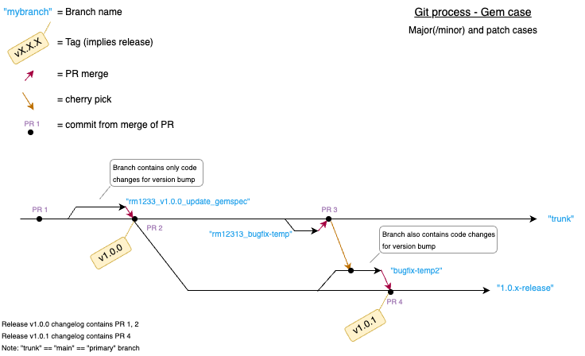

# Release

This file describes the process for publishing a new version of the gem as a GitHub release.

Releases are managed through the [GitHub Releases](https://github.com/dchbx/resource_registry/releases) page.

Release names follow the [Semantic Versioning](https://semver.org/) standard.

Follow the steps below to package and release a new version of the gem.

## Major/Minor release
### Prepare the release
1. Checkout the main branch and pull the latest changes.
2. Create and checkout a branch - avoid naming the branch solely after proposed release number - something like 'rm12313453_v1.0.0._update_gemspec' might be ideal.
3. Update the version number in the `lib/<project>/version.rb` file. Note the [correct format](https://guides.rubygems.org/specification-reference/#version); only digits and dots are allowed. Do not include a `v` prefix.
4. Update the `Gemfile.lock` file:  
    - `bundle update --patch --conservative resource_registry` will generally reduce dependency bumps. Typically, other effects in the lockfile beyond the gem itself being bumped should be discarded.
    - See bundler documentation for detailed information on how this [command](https://bundler.io/v2.5/man/bundle-update.1.html) behaves.
5. Commit the changes with a message like `bump version to v1.0.0`.
6. Push the branch and raise a pull request against the main branch. The pull request title should follow the format: `bump version to v1.0.0`. Be sure to label the pull request with the `version-bump` label.

### Publishing the Release
1. Once the pull request is approved and merged, checkout the main branch and pull the latest changes.
2. Create a new release branch in the pattern of `1.0.x-release`.
    - Note: `x` is literal, to aid reuse of same branch for minor bugfixes.
3. Create a new annotated tag with the version number, e.g., `git tag -as v1.0.0 -m "v1.0.0"`.
    - IMPORTANT: make sure the tag abides by the format `vX.Y.Z` where `X`, `Y`, and `Z` are integers. It is important that the tag name has a different format than any branch name to avoid confusion with Bundler.
4. Push the tag to the remote repository, e.g., `git push origin refs/tags/v1.0.0`.
    - Avoid `git push --tags`, to not accidentally push random assorted local tags.
5. GitHub Actions will automatically create a new release on the [GitHub Releases](https://github.com/dchbx/resource_registry/releases) page with release notes. Confirm that the release was successfully published there and that all intended commits are included in the release.

## Patch/Bugfix release
### Prepare the release
1. Fix bug in the main branch, via normal PR process.

For any release that has the bug:
2. Create a temp branch off any live release branch that has the bug - pick a name that won't conflict with another branch or tag, as with Major/Minor step 2.
    - Using a branch, which is then PR’d, ensures traceability and inclusion of an item in the generated release notes.
3. Cherry-pick the fix commits to the temp branch.
4. Update the gem `version.rb` file and `Gemfile.lock` as in Major/Minor release steps 3 and 4.
5. `git push` the temp branch.
6. Issue a PR to merge to the release branch.

### Publishing the Release
1. Once the pull request is approved and merged, checkout the release branch and pull the latest changes.
2. Create a new annotated tag with the version number, at the point of the release branch with the fix, e.g., `git tag -as v1.0.1 -m "v1.0.1"`.
3. Push the tag to the remote repository, e.g., `git push origin refs/tags/v1.0.1`.
    - Again, better to avoid `git push --tags`.
4. Github Actions will create the release and pull in the fix PR's to the changelog.

## Using a Tagged Release in Another Project
To use the new release in another project, update the project's `Gemfile` to reference the release's tag, e.g., `gem 'resource_registry', git: 'https://github.com/dchbx/resource_registry.git', tag: 'v1.0.0'`.

## Git Process diagram

